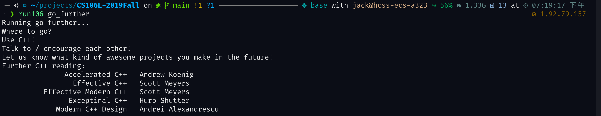
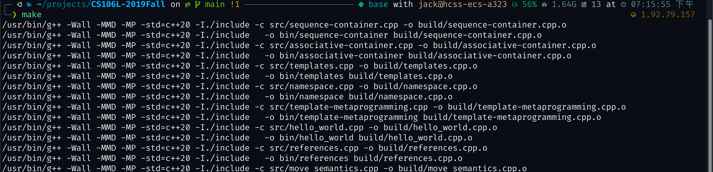
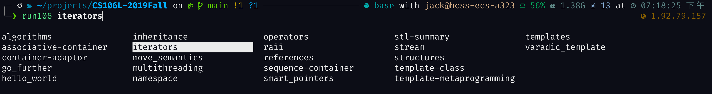

# CS106L-2019Fall
Code and resources of CS106 2019Fall. All rights reserved for Stanford.


## How to Use

### Download the repository

Run the following comand to download the repository
```bash
git clone https://github.com/jackwang0108/CS106L-2019Fall.git
```

### Build the codes

Run the following command to build the code

```bash
cd <path-to-project>
make all
```



Bu default, the binaries will be output into `<path-to-project>/bin`, and objective files will be output to `<path-to-project>/build`.

To clean and rebuild, you can also run clean first
```bash
make clean
```

I've written a lot of the comments in the `Makefile`, I believe you will learn alot from the makefile ;).


### Run the program

I provide a script `run106.h` to ease running the code. Note, the script is only tested for `zsh`.

To use the script, first run:
```bash
source ./run106.sh
```

and then use command `run106` with tab completion
```bash
run106 <Tab><Tab>
```
